<sub>⚙️ This README is automatically generated by a LLM.</sub>

# RECENTRE — Real-time head-motion prediction for fMRI

Predict the **next** head-motion frame from a stream of past frames, one step ahead, so a scanner (or a prospective-motion-correction system) can react *before* the head has finished moving.

Models are trained on the [HCP](https://www.humanconnectome.org/) head-motion time series (6 degrees of freedom: 3 translations + 3 rotations, sampled every 720 ms). For every frame a model outputs a **Gaussian per dimension** — a mean *and* a variance — so it reports not just where the head will be, but how sure it is. The objective is to beat the obvious "the head won't move" baseline on **framewise displacement (FD)** while keeping the uncertainty **calibrated**, at a latency low enough for real-time deployment.

This project starts from the original RECENTRE GRU ([Argiento et al. 2025](https://arxiv.org/abs/2505.09963)), reproduces it inside a clean config-driven pipeline, and then benchmarks **9 architectures × 4 sequence lengths** — TCN, Transformer, PatchTST, NLinear, DLinear, TSMixer, Conformer, Mamba, and the GRU — on accuracy, size, latency, noise robustness, and calibration.

<p align="center">
  <br>
  <em>One test patient, all 6 DOF. Predicted mean (with ±σ band) tracks ground truth one step ahead.</em>
</p>

---

## The idea in one minute

**The baseline is hard to beat.** Head motion is slow and smooth, so "next frame ≈ current frame" — the *previous-frame* (lag-1) baseline — is already a very good predictor. Any useful model has to do measurably better than repeating the last frame.

**We measure everything in FD.** Framewise displacement collapses the 6-DOF change between two frames into a single scalar in millimetres — translations summed directly, rotations converted to mm via a 50 mm head radius. The headline metric is **FD-gain**:

```
fd_gain = (FD_baseline − FD_model) / FD_baseline      # >0 means we beat "don't move"
```

**Models predict a residual, not the frame.** Every architecture's mean head outputs a *correction* added to the last input frame — the right inductive bias when consecutive frames are nearly identical — plus a second head for the variance. So `forward` returns `(last_frame + Δμ, σ²)`.

**The loss has two terms.** Gaussian negative log-likelihood (which trains both the mean *and* the variance) minus a weight `β` times the FD-gain:

```
loss = GaussianNLL(μ, σ², target)  −  β · mean(fd_gain)
```

`β` is the dial between *calibrated uncertainty* (low β) and *aggressive FD reduction* (high β). Early stopping and model selection use validation FD-gain, not the raw loss.

**Inputs are physics-augmented.** Each channel is the raw position plus a stride-2 velocity `x[t]−x[t−2]` and a second-difference acceleration channel, all z-scored with a single per-channel mean/σ computed on the training set only.

---

## Headline result: the architecture benchmark

We trained 9 architectures at sequence lengths {10, 32, 64, 128} and ranked them by mean FD-gain on held-out patients (R+M+L, disjoint patient splits). The **Conformer wins**, the **Mamba** is second, and the **GRU** is third — but the GRU is by far the cheapest of the leaders to run.

<p align="center">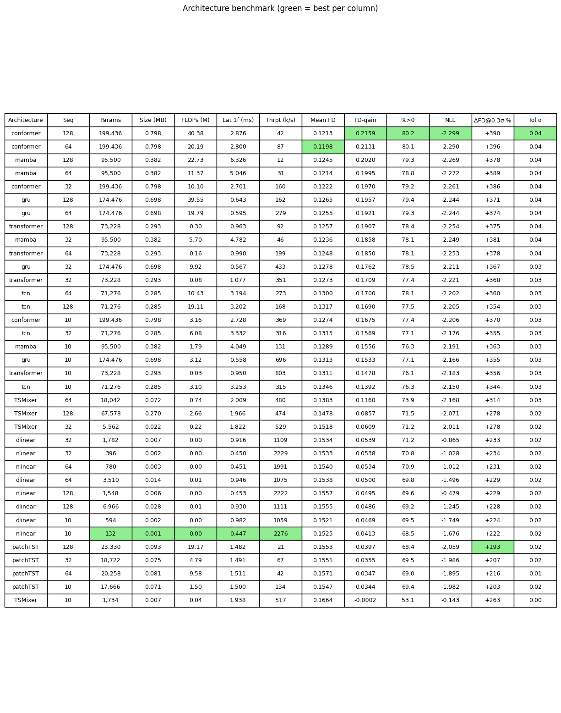</p>

Top of the table (best checkpoint per architecture, sorted by FD-gain):

| Architecture | Seq | Params | FLOPs (M) | Latency (ms) | Mean FD | **FD-gain** | %>0 | NLL |
|--------------|----:|-------:|----------:|-------------:|--------:|------------:|----:|----:|
| **conformer**   | 128 | 199,436 | 40.4 | 2.88 | 0.1213 | **0.216** | 80.2 | −2.30 |
| conformer       |  64 | 199,436 | 20.2 | 2.80 | 0.1198 | 0.213 | 80.1 | −2.29 |
| gru (distilled) | 128 | 174,476 | 39.6 | **0.64** | 0.1236 | 0.205 | 79.3 | −2.29 |
| **mamba**       | 128 |  95,500 | 22.7 | 6.33 | 0.1245 | 0.202 | 79.3 | −2.27 |
| mamba           |  64 |  95,500 | 11.4 | 5.05 | 0.1214 | 0.199 | 78.8 | −2.27 |
| **gru**         | 128 | 174,476 | 39.6 | **0.64** | 0.1265 | 0.196 | 79.4 | −2.24 |
| transformer     | 128 |  73,228 |  0.30 | 0.96 | 0.1257 | 0.191 | 78.4 | −2.25 |
| tcn             |  64 |  71,276 | 10.4 | 3.19 | 0.1300 | 0.170 | 78.1 | −2.20 |
| TSMixer         |  64 |  18,042 |  0.74 | 2.01 | 0.1383 | 0.116 | 73.9 | −2.17 |
| dlinear         |  32 |   1,782 |  0.00 | 0.92 | 0.1534 | 0.054 | 71.2 | −0.86 |
| nlinear         |  32 |     396 |  0.00 | 0.45 | 0.1533 | 0.054 | 70.8 | −1.03 |
| patchTST        | 128 |  23,330 | 19.2 | 1.48 | 0.1553 | 0.040 | 68.4 | −2.06 |

*Full 37-row table (all archs × all seq lengths, plus size, throughput, noise columns) lives in [`results/benchmark/benchmark_table.md`](results/benchmark/benchmark_table.md).*

Two clear lessons:

- **Channel mixing matters.** The channel-*independent* models — PatchTST, NLinear, DLinear — sit at the bottom. The 6 DOF are physically coupled, and models that mix across channels (Conformer, Mamba, GRU, TSMixer) exploit that; the ones that treat each channel separately cannot.
- **Sequence length is the single biggest accuracy lever** — see the scan below.

### The Pareto frontiers

Accuracy (FD-gain) against each real-world cost axis — latency, FLOPs, model size — plus FD-gain vs. noise tolerance. The Conformer leads on accuracy, Mamba follows, and the **GRU offers the best accuracy-per-latency trade-off** (its recurrence is ~4–10× faster to evaluate one frame than the attention/SSM models). The noise-tolerance panel is essentially a straight line: there is no specially "noise-robust" architecture, just better models overall that need more injected noise to fall below the clean baseline.

<p align="center">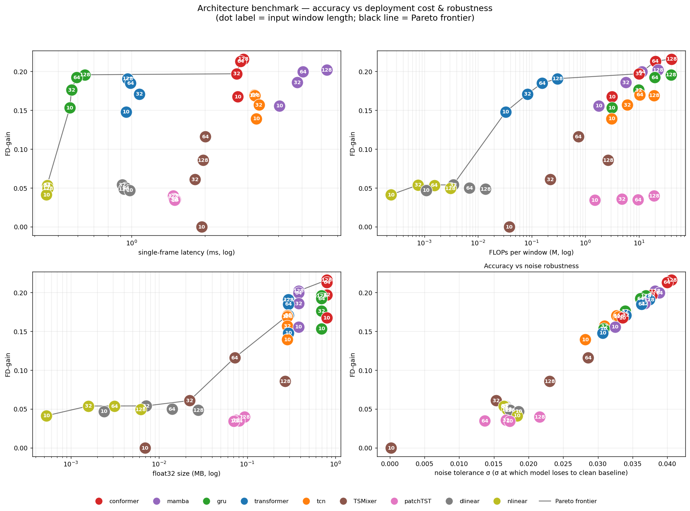</p>

### Sequence length scan

FD-gain vs. input length for the best three models. Accuracy rises with sequence length, but past **T = 64** it's diminishing returns — and mean FD even slightly *worsens* from T = 64 → 128. For real-time use, T = 64 is the sweet spot.

<p align="center">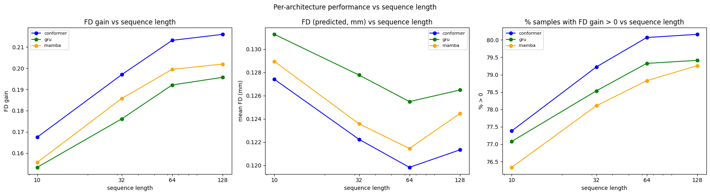</p>

---

## Distillation: pushing the fast model up

The Conformer is the most accurate but ~4× slower per frame than the GRU. So we **distilled the Conformer into the GRU** — matching both the output distribution (KL between the two predicted Gaussians) and the pre-head latent features (MSE after a learned projection). The distilled GRU (`gru_distilled` in the table above) reaches **FD-gain 0.205 vs. the vanilla GRU's 0.196**, closing most of the gap to Mamba/Conformer *while keeping the GRU's 0.64 ms latency* — the best speed/accuracy point in the study.

<p align="center">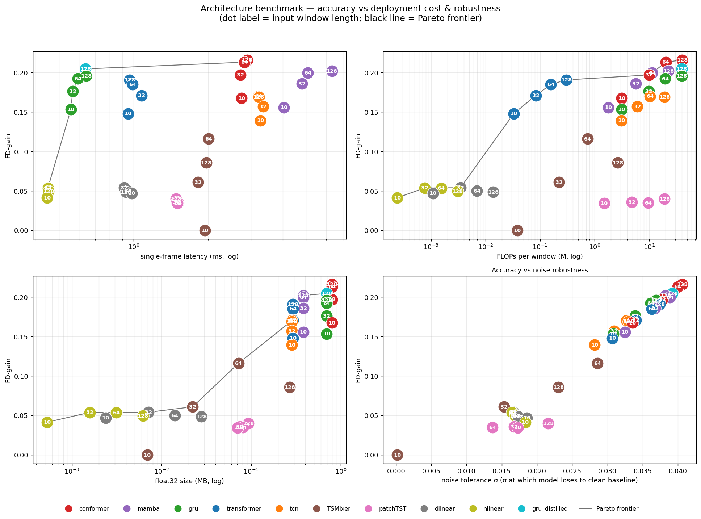</p>

---

## Routing over experts (learned ensemble)

Inspired by mixture-of-experts, we froze the best Conformer, Mamba, and GRU (seq 128) plus the previous-frame baseline, and trained a small **router MLP** that reads each expert's per-frame residual and σ and emits softmax blend weights, trained end-to-end to minimize FD directly. This is *stacking*, not a true MoE — the experts are pretrained and frozen. The router trains on validation patients and is evaluated on the held-out test patients (unseen by every expert).

| Policy | FD-gain |
|--------|--------:|
| Conformer (single) | 0.2159 |
| Mamba (single)     | 0.2020 |
| GRU (single)       | 0.1957 |
| Fixed mean (⅓ each)   | 0.2196 |
| **Soft router**    | **0.2238** |
| Fixed router-mean weights | 0.2221 |

The learned per-frame router does win, but only marginally over a good fixed average. Average router weights: **61% Conformer, 16% Mamba, 15% GRU, 8% baseline** — every expert is blended in, and better models get more weight. Takeaway: most per-frame headroom is irreducible noise, so a single strong model or a fixed average remains the practical choice.

---

## Reproducing the GRU baseline

Before benchmarking, we reproduced the original RECENTRE GRU inside the new pipeline — a single generalist model trained and tested on all three tasks (R+M+L) over disjoint patient splits.

**It tracks the motion accurately.** True vs. predicted, per dimension, on held-out patients. Every DOF reaches R² > 0.94.

<p align="center">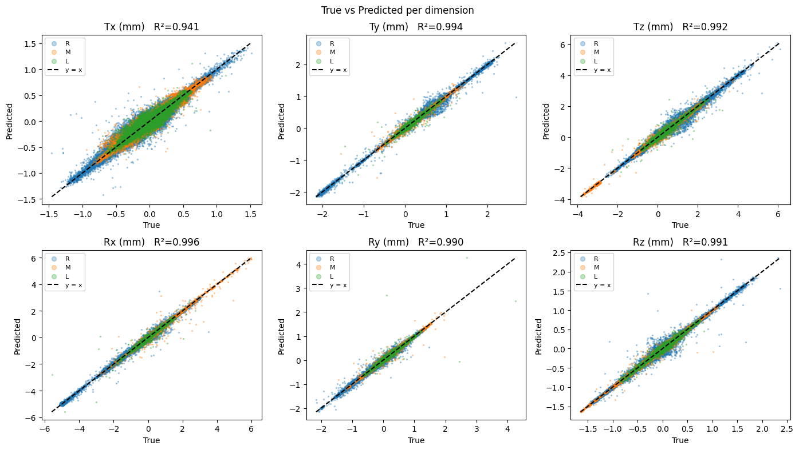</p>

**It beats the previous-frame baseline where it matters.** Model FD sits below the lag-1 baseline, and **74.8%** of frames are improved. FD-gain is negative for tiny motions (when the head is basically still you can't beat "don't move," and shouldn't try) and climbs once there is real motion to anticipate — exactly the regime that matters for motion correction.

<p align="center">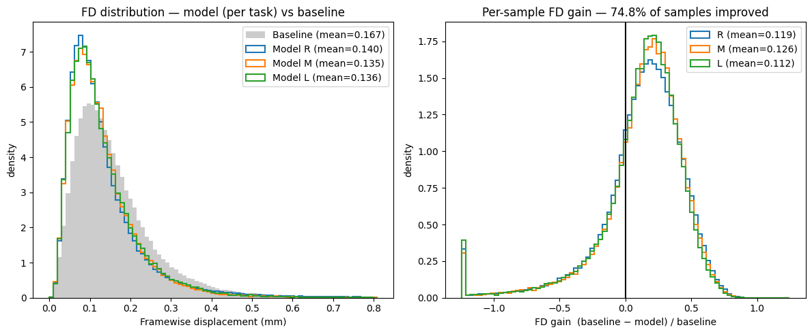</p>

**Almost every patient improves.** Per-patient FD-gain, sorted within each task: **>92%** of patients improved in every task, with a handful of near-still patients where the baseline is already optimal.

<p align="center">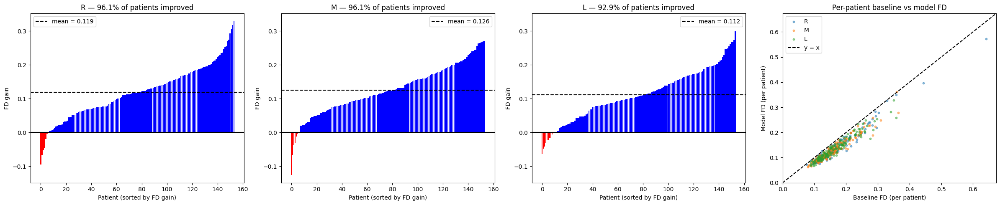</p>

### The β trade-off, swept

The original work fixed β = 0.1 arbitrarily. Sweeping β over orders of magnitude: NLL and calibration are best at low β, FD-gain peaks around **β ≈ 0.5–1**, and pushing β higher trades calibration away for diminishing (and eventually negative) FD returns — an overfitting effect specific to the FD-gain term. **β = 0.5** is the default sweet spot.

<p align="center">
  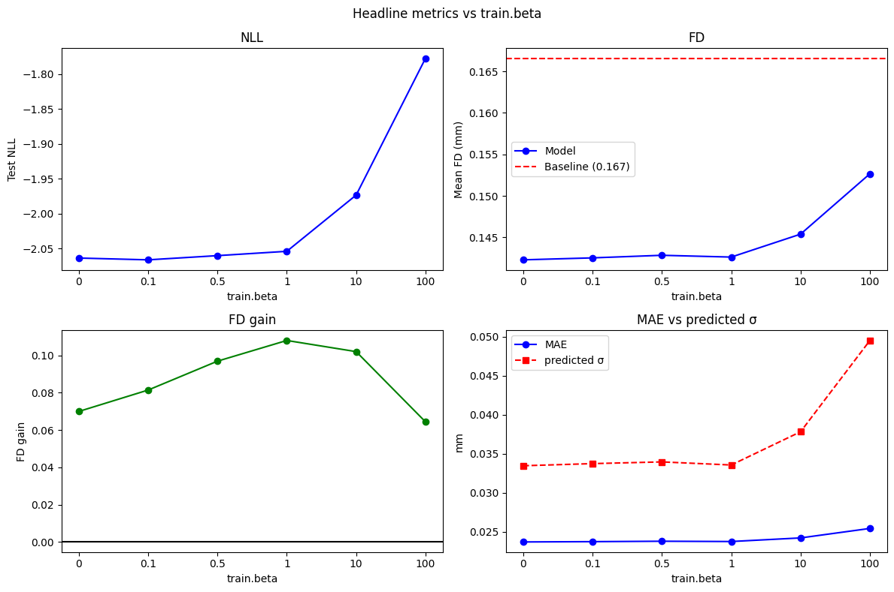<br>
  <em>Headline metrics vs. β: NLL, mean FD vs. baseline, FD-gain, and MAE vs. predicted σ.</em>
</p>
<p align="center">
  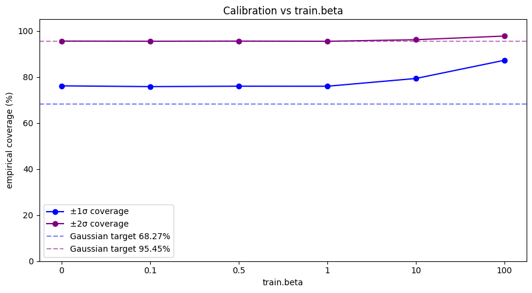<br>
  <em>Calibration vs. β: empirical coverage of the ±1σ / ±2σ intervals against their Gaussian targets — degrades as β grows.</em>
</p>

### Per-patient fine-tuning helps further

Starting from the generalist model and fine-tuning a few epochs on each patient's own early frames (MSE + FD-gain loss, with an L2-SP penalty anchoring to the pretrained weights) lifts the improved-patient rate to **>95%** in every task, with an **80%** per-patient win rate and a mean FD-gain shift of **+0.047**.

<p align="center">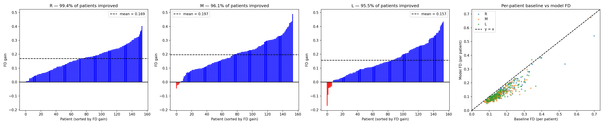</p>
<p align="center">
  
  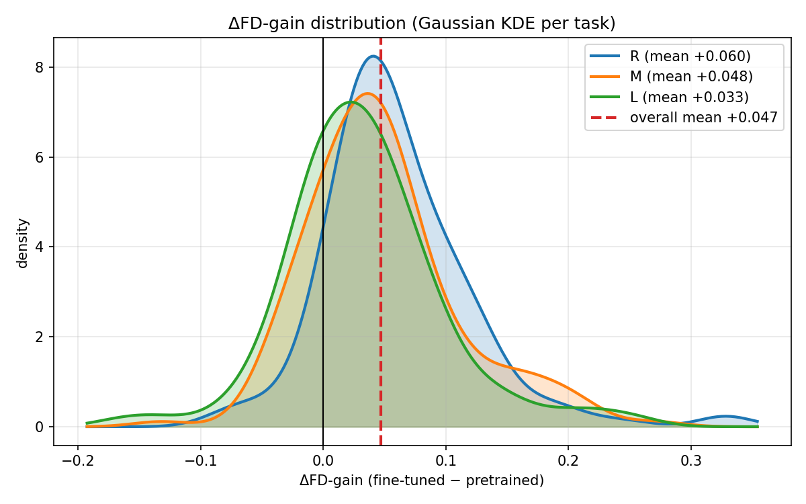<br>
  <em>Left: per-patient FD-gain before vs. after fine-tuning (points above y=x improved). Right: distribution of the per-patient FD-gain improvement (mean shift +0.047).</em>
</p>

---

## Ablations

### Feature augmentation — velocity is the win

Appending stride-2 velocity (`x[t]−x[t−2]`, recomputed because the model sees every 2nd frame) and acceleration channels. Velocity gives a large jump; acceleration adds nothing measurable, but we keep both for all models.

| Augmentation | FD_pred | FD-gain | % frames > base |
|--------------|--------:|--------:|----------------:|
| None    | 0.134 | 0.145 | 76.5 |
| Vel     | 0.129 | 0.172 | 78.5 |
| Vel+acc | 0.129 | 0.171 | 78.1 |

### Data augmentation — negation helps, time-reversal hurts

Translations and rotations are physically coupled, so there's little room for independent transforms. Of the two physically plausible ones, **negation (sign flip)** improves the clean test set while **time-reversal degrades it**. All models are trained with negation augmentation.

| Augmentation | FD_pred | FD-gain | % frames > base |
|--------------|--------:|--------:|----------------:|
| None          | 0.143 | 0.097 | 73.0 |
| Time-reversal | 0.146 | 0.078 | 70.9 |
| **Negation**  | 0.141 | **0.114** | 75.2 |
| Both          | 0.145 | 0.085 | 71.9 |

### Jerk penalty — no measurable edge

A kinematic prior: penalize jerk `J(t) = x[t] − 3x[t−2] + 3x[t−4] − x[t−6]` with weight γ. Swept over orders of magnitude, the best γ buys only ~0.002 (~1%) FD-gain over γ = 0 — within noise. Not enough to conclude a real effect without repeated-run error bars.

| γ | Mean FD | FD-gain | % frames > base |
|---|--------:|--------:|----------------:|
| 0    | 0.1268 | 0.1778 | 78.4 |
| 0.3  | 0.1273 | 0.1798 | 78.8 |
| 1    | 0.1363 | 0.1514 | 77.3 |

---

## Usage

Needs `pyyaml` on top of `torch` / `numpy` / `matplotlib` / `scipy` / `tqdm`. No build step, no tests — a flat set of scripts driven by YAML configs.

```bash
# 0. One-time: build the per-task .npy dicts from raw HCP txt files
#    (edit data_paths inside preprocessing.py first)
python preprocessing.py

# 1. Train one model — everything is specified by the config you pass
python train.py configs/gru_generalist.yaml       # or conformer_/mamba_/tcn_/... generalist.yaml

# 2. Evaluate a checkpoint -> writes the figures to results/
#    (the model is rebuilt from the config embedded in the checkpoint)
python evaluate.py checkpoints/generalist/gru_R+M+LvR+M+L_beta0.5_ep150.pth

# 3. Compare a folder of checkpoints, grouped by a config field (default train.beta)
python compare.py checkpoints/beta_scan

# 4. Per-patient fine-tuning sweep -> CSV, then plot it
python finetune.py configs/finetune.yaml
python finetune_plots.py

# 5. Per-frame router (stacking) over the frozen best experts + baseline
python routing.py

# 6. Distill the conformer into the GRU
python distill.py configs/distill_gru.yaml
```

**Everything lives in the config.** Model type, hyperparameters, tasks, loss, `β`, epochs, input window length, augmentation, and fine-tuning knobs are all set in `configs/*.yaml` — nothing is hardcoded in the eval scripts. Each checkpoint embeds its full config, so `evaluate.py` / `compare.py` / `finetune.py` rebuild the exact model with no hyperparameters repeated anywhere.

A minimal config:

```yaml
model:
  type: gru          # key in MODELS (models.py); add architectures there
  input_dim: 18      # 6 positions + 6 velocity + 6 acceleration channels
  hidden_dim: 128
  num_layers: 2
  dropout: 0.5
data:
  train_task: R+M+L  # Resting + Memory + Language
  test_task: R+M+L
  sequence_length: 64   # input window (frames), stride 2
  split_percentages: [0.7, 0.15, 0.15]
  cross_patients: false
train:
  loss: gaussian_nll
  beta: 0.5
  epochs: 150
```

---

## Repo layout

A deliberately flat, simple codebase — no packages, no abstraction layers.

| File | Role |
|------|------|
| `preprocessing.py` | Raw HCP `txt` → per-task `{patient_id: ndarray[T, 6]}` dicts. Drops derivative columns, converts rotations deg→rad, keeps patients present in all three tasks. |
| `dataset.py` | `TimeSeriesDataset`, the GPU-resident `GPUBatchLoader`, `build_features` (velocity/accel + z-score), and `split_data` (leakage-safe train/val/test patient splits). |
| `models.py` | Model classes + the `MODELS` registry + `build_model(config)`. Add an architecture = one class + one line. |
| `metrics.py` | `fd`, `fd_gain`, and `evaluate()` — the single evaluation path used by every script. |
| `engine.py` | `fit()` — the one training loop, shared by pretraining and fine-tuning. |
| `train.py` / `finetune.py` / `resume.py` | Drivers; each reads a YAML config. |
| `sweep.py` / `compare.py` / `robustness.py` | Shared eval engine + checkpoint comparison + added-noise robustness. |
| `routing.py` | Per-frame router (stacking) over frozen experts + baseline. |
| `distill.py` | Conformer → GRU knowledge distillation (output KL + latent MSE). |
| `plots.py` / `finetune_plots.py` / `evaluate.py` | Figure generation. |
| `configs/*.yaml` | The surface you edit. |

### Architectures

`models.py` holds a registry of 9 forecasters, all sharing the same output contract — two heads (mean, log-variance) reading the model's latent space, and a residual prediction added to the last frame:

- **GRU** — the original RECENTRE recurrent baseline; cheapest per-frame latency.
- **Conformer** — attention + convolution sandwich; the most accurate model here.
- **Mamba** — selective state-space model, content-dependent update; second best.
- **Transformer** — encoder-only self-attention with sinusoidal positions.
- **TCN** — dilated causal temporal convolutions.
- **PatchTST / NLinear / DLinear** — channel-independent forecasters; weak here (channels are coupled).
- **TSMixer** — alternating time-mixing / channel-mixing MLPs.

<p align="center">
  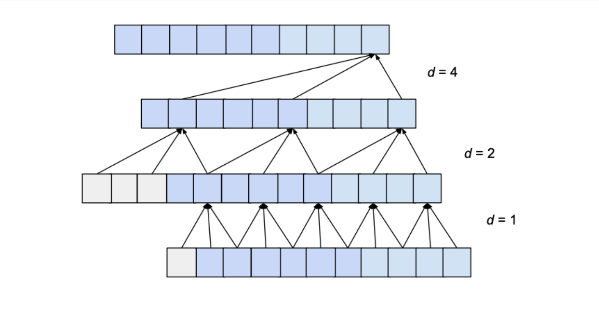
  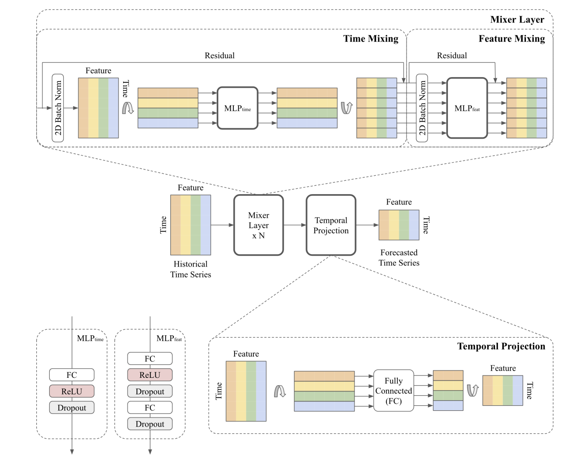<br>
  <em>Schematic forward passes: TCN (left) and TSMixer (right).</em>
</p>

### Data

HCP, three tasks with fixed lengths per task — Resting (T=1200), Memory (T=405), Language (T=316), 1027 patients present in all three. Dimension order is fixed throughout: `[Tx, Ty, Tz, Rx, Ry, Rz]`, with rotation indices `3:6` getting the ×50 mm scaling for FD. Normalization stats (`μ`, `σ`) are computed on training frames only and travel inside each checkpoint.

---

*A student research project (Advanced Machine Learning for Physics) benchmarking modern sequence architectures for real-time MRI motion prediction, building on the original RECENTRE GRU. The architecture registry and config-driven pipeline are built so new models drop in and compete on identical footing.*
