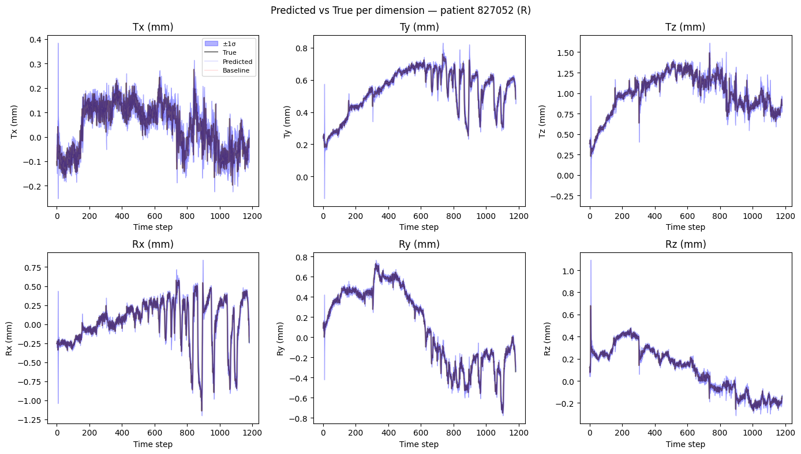
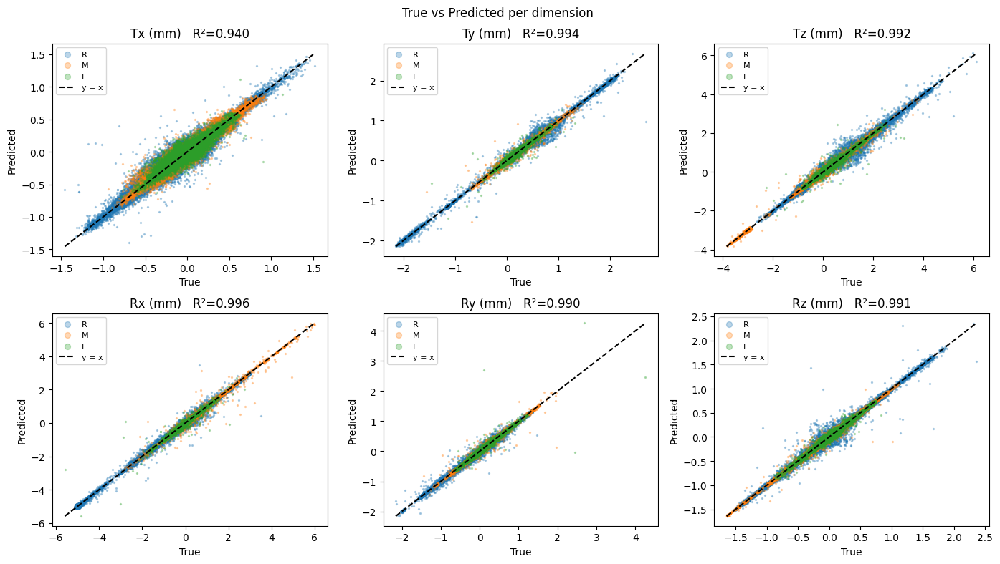
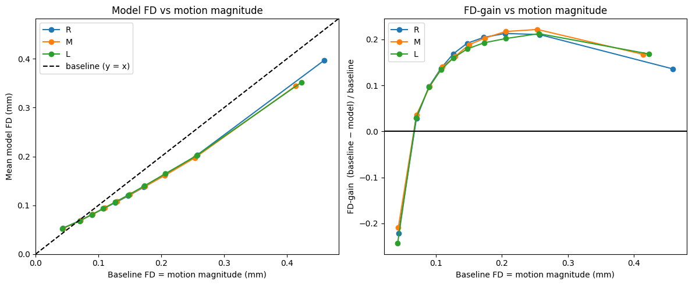
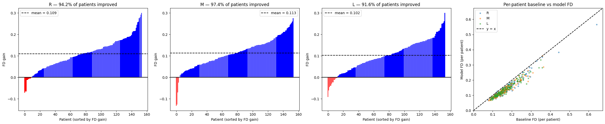
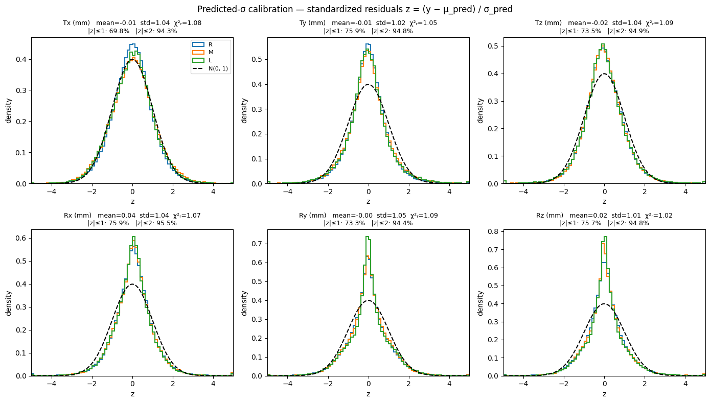
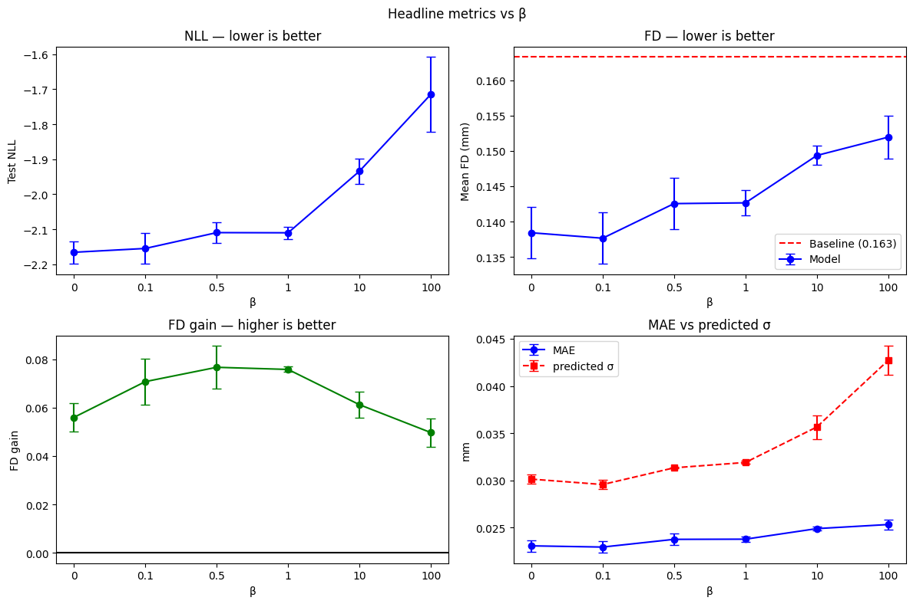
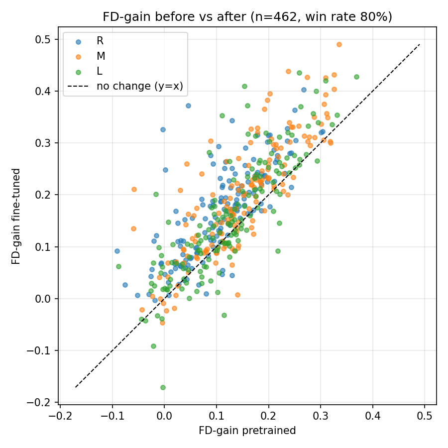

<sub>⚙️ This README is automatically generated by a LLM.</sub>

# RECENTRE — Real-time head-motion prediction for fMRI

Predict the **next** head-motion frame from a stream of past frames, one step ahead, so a scanner (or a prospective-motion-correction system) can react *before* the head has finished moving.

The model is a small probabilistic **GRU** trained on the [HCP](https://www.humanconnectome.org/) head-motion time series (6 degrees of freedom: 3 translations + 3 rotations). For every frame it outputs a **Gaussian per dimension** — a mean *and* a variance — so it reports not just where the head will be, but how sure it is. It is trained to beat the obvious "the head won't move" baseline on **framewise displacement (FD)** while keeping its uncertainty **calibrated**.

<p align="center">
  <br>
  <em>One test patient, all 6 DOF. Predicted mean (with ±σ band) tracks ground truth one step ahead.</em>
</p>

---

## The idea in one minute

**The baseline is hard to beat.** Head motion is slow and smooth, so "next frame ≈ current frame" (the *previous-frame baseline*) is already a very good predictor. Any useful model has to do measurably better than simply repeating the last frame.

**We measure everything in FD.** Framewise displacement collapses the 6-DOF change between two frames into a single scalar in millimetres — translations summed directly, rotations converted to mm via a 50 mm head radius. The headline metric is **FD-gain**:

```
fd_gain = (FD_baseline − FD_model) / FD_baseline      # >0 means we beat "don't move"
```

**The model predicts a residual, not the frame.** The GRU's mean head outputs a *correction* added to the last input frame, which is the right inductive bias when consecutive frames are nearly identical. A second head outputs the variance.

**The loss has two terms.** Gaussian negative log-likelihood (which trains both the mean *and* the variance) minus a weight `β` times the FD-gain:

```
loss = GaussianNLL(μ, σ², target)  −  β · mean(fd_gain)
```

`β` is the dial between *calibrated uncertainty* (low β) and *aggressive FD reduction* (high β). Early stopping and model selection use validation FD-gain, not the raw loss.

---

## Results

### It tracks the motion accurately

True vs. predicted, per dimension, on held-out patients across all three tasks (Resting / Memory / Language). R² ranges from 0.94 (the hardest translation axis) to ~0.996.

<p align="center"></p>

### It beats the previous-frame baseline — where it matters

The left panel shows model FD stays *below* the `y = x` baseline line. The right panel is the key story: FD-gain is **negative for tiny motions** (when the head is basically still, you can't beat "don't move" and shouldn't try) and climbs to **~20% gain** once there is real motion to anticipate. This is exactly the regime that matters for motion correction.

<p align="center"></p>

### Almost every patient improves

Per-patient FD-gain, sorted. **92–97%** of held-out patients are improved over baseline, with a handful of near-still patients (red) where the baseline is already optimal.

<p align="center"></p>

### The uncertainty is calibrated

Standardized residuals `z = (y − μ) / σ` should be unit Gaussians if σ is honest. Across all 6 DOF and all 3 tasks: mean(z) ≈ 0, std(z) ≈ 1, reduced χ² ≈ 1. The predicted σ means something — it can be used to fall back to the baseline when the model is unsure.

<p align="center"></p>

### The β trade-off, swept

Sweeping `β` from 0 → 100: NLL and calibration are best at low β, FD-gain peaks around **β ≈ 0.5–1**, and pushing β higher trades calibration away for diminishing FD returns. `β = 0.5` is the default sweet spot.

<p align="center"></p>

### Per-patient fine-tuning helps further

Starting from the generalist model and fine-tuning a few epochs on each patient's own early frames (with an L2-SP penalty anchoring to the pretrained weights) improves FD-gain for **~80%** of patients.

<p align="center">
  
  
</p>

---

## Usage

Needs `pyyaml` on top of `torch` / `numpy` / `matplotlib` / `scipy` / `tqdm`. No build step, no tests — a flat set of scripts driven by YAML configs.

```bash
# 0. One-time: build the per-task .npy dicts from raw HCP txt files
#    (edit data_paths inside preprocessing.py first)
python preprocessing.py

# 1. Train one model — everything is specified by the config you pass
python train.py configs/gru_generalist.yaml

# 2. Evaluate a checkpoint -> writes the 8 figures to results/
#    (the model is rebuilt from the config embedded in the checkpoint)
python evaluate.py checkpoints/generalist/GRU_R+M+LvR+M+L_beta0.5_ep150.pth

# 3. Sweep beta: edit `beta` in the config, re-run train.py a few times,
#    then compare the resulting checkpoints grouped by beta
python compare.py checkpoints/beta_scan

# 4. Per-patient fine-tuning sweep -> CSV, then plot it
python finetune.py configs/gru_finetune.yaml
python finetune_plots.py
```

**Everything lives in the config.** Model type, hyperparameters, tasks, loss, `β`, epochs, the input window length, and the fine-tuning knobs are all set in `configs/*.yaml` — nothing is hardcoded in the eval scripts. Each checkpoint embeds its full config, so `evaluate.py` / `compare.py` / `finetune.py` rebuild the exact model with no hyperparameters repeated anywhere.

A minimal config:

```yaml
model:
  type: gru          # key in MODELS (models.py); add architectures there
  input_dim: 6
  hidden_dim: 128
  num_layers: 2
  dropout: 0.5
data:
  train_task: R+M+L  # Resting + Memory + Language
  test_task: R+M+L
  sequence_length: 10   # input window = 10 frames at stride 2 (spans 20 frames)
  split_percentages: [0.7, 0.15, 0.15]
  cross_patients: false
train:
  loss: gaussian_nll
  beta: 0.5
  epochs: 150
```

---

## Repo layout

A deliberately flat, simple codebase — no packages, no abstraction layers.

| File | Role |
|------|------|
| `preprocessing.py` | Raw HCP `txt` → per-task `{patient_id: ndarray[T, 6]}` dicts. Drops derivative columns, converts rotations deg→rad, keeps patients present in all three tasks. |
| `dataset.py` | `TimeSeriesDataset`, the GPU-resident `GPUBatchLoader`, and `split_data` (leakage-safe train/val/test patient splits). |
| `models.py` | Model classes + the `MODELS` registry + `build_model(config)`. Add an architecture = one class + one line. |
| `metrics.py` | `fd`, `fd_gain`, and `evaluate()` — the single evaluation path used by every script. |
| `engine.py` | `fit()` — the one training loop, shared by pretraining and fine-tuning. |
| `train.py` / `finetune.py` | Drivers; each reads a YAML config. |
| `plots.py` / `finetune_plots.py` / `evaluate.py` / `compare.py` | Figure generation and checkpoint comparison. |
| `configs/*.yaml` | The surface you edit. |

### Model

`GRU (2-layer) → LayerNorm → ReLU → FC → LayerNorm → ReLU → Dropout → two heads (mean, log-variance)`.
The mean head predicts a **residual** added to the last input frame; the variance is returned already exponentiated. So `forward` returns `(last_frame + Δμ, σ²)`.

### Data

HCP, three tasks with fixed lengths per task — Resting (T=1200), Memory (T=405), Language (T=316). Dimension order is fixed throughout: `[Tx, Ty, Tz, Rx, Ry, Rz]`, with rotation indices `3:6` getting the ×50 mm scaling for FD. Normalization stats (`μ`, `σ`) are computed on training frames only and travel inside each checkpoint.

---

*A student research project benchmarking a GRU baseline for real-time MRI motion prediction. The architecture registry and config-driven pipeline are built so that TCN / Transformer / hybrid models can be dropped in and compared on identical footing.*
